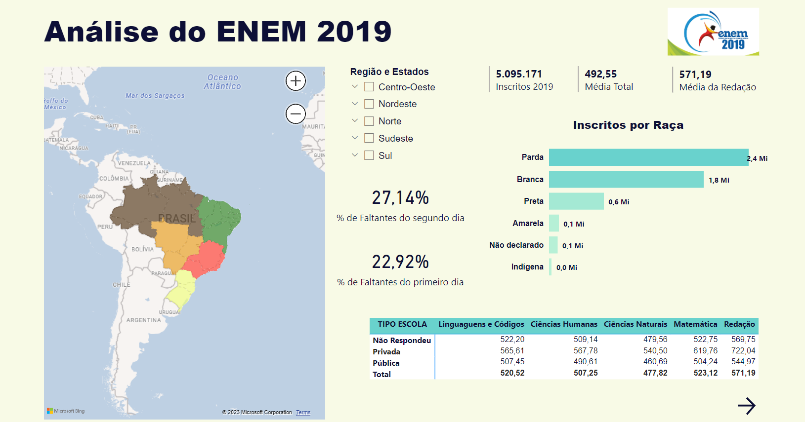

<h1 align='center'>
    
    
Análise dos dados do ENEM 

</h1>

##  📕 Resumo

Com o intuito de estudar e aplicar a linguagem Python junto ao Power BI, foi feita uma análise dos dados com o Python e suas bibliotecas e feito, posteriormente, um dashboard no Power BI.

## Bibliotecas Utilizadas 🔨

  - **Pandas, Numpy** - Para análise dos dados.
  - **Matplotlib, Seaborn** - Para elaboração dos gráficos.
  - **Zipfile** - Para trabalhar com o arquivo zipado. Por este ser muito grande.

## 📗 Sobre o Projeto

A análise foi feita para entender melhor o quanto a pandemia afetou o ensino e, consequentemente, o ENEM. Prova que é responsável tanto para ingresso na Universidade quanto para certificar a conclusão do ensino médio.

Os dados foram obtidos pelo site do [INEP](https://www.gov.br/inep/pt-br/acesso-a-informacao/dados-abertos/microdados/enem) os dados foram vistos pelo Jupyter Notebook e, posteriormente, a algumas análises e hipóteses foi feito um dashboard no Power BI para ter um maior dinamismo na observação dos dados.

## Dashboard

    

